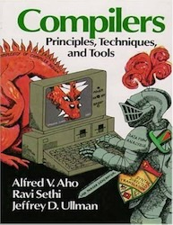
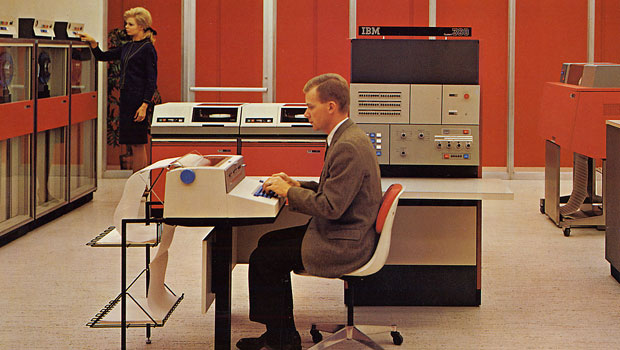

# 1. Calculator: Arithmetic, Bindings

**Contents**
- [1.1 Soul of the machine]()
- [1.2 ]

*And Dennis said, "Let there be C" and [there was C](https://en.wikipedia.org/wiki/The_C_Programming_Language).*

Some of the first C compiler designs which involved preprocessing, lexing,
parsing, code generation, assembling and loading were described in
[(Johnson 1979)](https://c9x.me/compile/bib/pcc-tour.pdf).
Shortly after, this three phase design with parsing at the front, optimizing in the
middle, and generating at the back was compiled into the seminal
["dragon book"](https://en.wikipedia.org/wiki/Compilers:_Principles).



The first chapter of the textbook implements a compiler for a subset of K&R C
with the dragon book's three phase batched design with the incremental approach
presented in [(Ghuloum 2006)](http://scheme2006.cs.uchicago.edu/11-ghuloum.pdf).
The incremental approach of implementing the compiler feature by feature
dumbs the dragon down into silly little dwarves — each piece easily understandable.
The first chapter sets up the skeleton for the entire compiler, and the subsequent
chapters implement a programming language with progressive complexity: capable
of performing calculation, control flow, and finally memory access. After the
first dragon is slain, another head grows, and the second
chapter of the textbook covers incremental/query-based compiler design in
compilers like `rustc`. That is, incremental in the compiler's phase order, not
the writer's implementation order.

## 1.1 Soul of the machine
From a systems perspective, a computer is a von Neumann machine
(see [Appendix A](./apa.md)) that bridges the semantic gap between humans and
electrons — a computer orchestrates electrons in order to evaluate algorithms
(a list of instructions). A machine whose computation is more limited in scope
for instance is that of a compass, but the interesting machines are those
that are capable of evaluating more expressive languages formalized as
[Turing complete](https://en.wikipedia.org/wiki/Turing_completeness). While
in theory processors are able to execute anything such as the
Lisp machines [(Moon 1985)](https://dl.acm.org/doi/pdf/10.5555/327010.327133),
what happens in practice is that the languages used to program computers are
closer to the metal. That is, they reflect the underlying hardware components,
like registers for instance. These languages are referred to as assembly, their
words as instructions, and their vocabulary as instruction set architeture (ISA).

All modern day ISAs owe spiritual debt to the family of System/360 mainframes,
made by International Business Machines. They were the first computers to unify
under a single ISA [(Amdahl, Blaauw, Brooks, Jr 1964)](https://www.ece.ucdavis.edu/~vojin/CLASSES/EEC272/S2005/Papers/IBM360-Amdahl_april64.pdf) where the ISA reference cardI
became infamously known as the ["green card"](http://archive.computerhistory.org/resources/access/text/2010/05/102678081-05-01-acc.pdf).

"IBM announced a line of six computers of vastly different cost and performance that all executed the same software, introducing the concept of the instruction set architecture (ISA) as an entity distinct from its hardware implementation"

reducing the number of mandatory user-level hardware instructions to 40. As with many RISC instruction sets, the remaining instructions fall into three categories: com- putation, control flow, and memory access. RISC-V is a load-store architecture, in which arithmetic instructions operate only on the registers, and only loads and stores transfer data to and from memory.

As Figure 3.1 shows, the entirety of the user-visible architectural state totals 1024 bits (32 registers, 32 bits).

Even though some instructions may not require all 32 bits of encoding, variable-length instructions would add complexity. Simplicity would also encourage a single-instruction format, but that is too restrictive. However, this issue allows us to introduce the last design principle:



While there are many points and tradeoffs in the space of ISA design, the textbook
defaults to what is most open: RISC-V [(Asanović, Patterson 2014)](https://people.eecs.berkeley.edu/~krste/papers/EECS-2014-146.pdf), [(Waterman 2016)](https://people.eecs.berkeley.edu/~krste/papers/EECS-2016-1.pdf), and [(Patterson, Waterman 2017)](http://riscvbook.com).

Returning to the original goal of the computer
— bridging the semantic gap between humans and electrons — assembly code is indeed
more ergonomic than expressing programs in machine code (raw binary encodings),
but there is a higher level of semantics which is even more ergonomic than that of
assembly. Modern day programming languages such as Java, Python, Lisp.
start with C, the portable assembly. The purpose of the compiler is to translate C to RISC-V.


```
     o
 _ /<.
 (*)>(*)
--------- C
 compiler
--------- RISCV
processor
---------
 e- e- e-
```

## 1.2 Here be dragons
- perf tuning (get metrics)
- https://discord.com/channels/1043278575190691914/1043278575874351106/1084286077436694578
- https://discord.com/channels/1043278575190691914/1043278575874351106/1331784065627721820

Frontend: Parser
Middlened: Optimizer
Backend: Generator

## Frontend
https://discord.com/channels/1043278575190691914/1142238075318190110/1157043651776630895


1-1, 1->n, m->1

## Backend
- instruction selection (selector)
- register allocation (allocator)
- instruction scheduling (scheduler)
-> gotta have machine ops to know what machine regs to use
-> all problems are NP-complete.

<!-- Codegen is as easy or difficult as you like.  Many many PhDs have been written about codegen.
I suspect LLVM's codegen is a "wee bit larger" than barely a single function.
Say like 1MLOC or such.  🙄 
I can do a job that I think is "ok-ish" in probably 10K lines for an X86.
This would be skipping, e.g. GC & safepoints; probably skipping inlining beyond trivial.
But would include LICM, instruction selection, basic block layout & graph coloring reg alloc (both using a frequency estimate).  This gets you a close to "-O2", but you'll still need sensible inlining to get there. 

insttruction selection/scheduler is considered code generation
because instructions have weird non-uniform effects.
=> many of which are just nost exciting when optimizing
=> therefore, most optimizer middleend work on idealized RISC-like instructions
=> much MUCH easier than trying to optimize x86ops

AST: A grammar nicely maps to a tree (production rules are describing tree fragments), and analysis/verification of the syntax and semantics follows that.
instruction selection
survey: https://arxiv.org/pdf/1306.4898

Moreover, the classic compiler textbooks only briefly discuss instruction selection and thus provide little insight; in the combined body of over 4,600 pages that constitute the compiler textbooks [8, 15, 59, 96, 173, 190, 262], less than 160 pages – of which there is tremendous overlap and basically only discuss tree covering

This highlights a well-known property of code generation: instruction selection, instruction scheduling, and register allocation are all interconnected with one another, forming a complex system that affects the quality of the final assembly code in complicated and often counter-intuitive ways.

To produce truly optimal code, therefore, all three tasks must be solved in unison. and much research has gone into devising such systems (some of which are covered in this report). phds...

macroexpansion.
However, naïve macro expansion assumes a 1-to-1 or 1-to-n mapping between nodes in the IR (or abstract syntax) tree and the machine instructions provided by the target machine. If there exist machine instructions that can be characterized as n-to-1 mappings, such as multi- output instructions, then code quality yielded by these techniques will typically be low

order is done by scheduling, which is generally after instruction selection and before register allocation.
ordering, especially on an X86, is a typically low-value optimization compared to e.g. loop optimizations and inlining (both done by the optimizer).
ordering on an x86 is sorta horse-shoes & hand-grenades; close is close enough.  So as long as the ordering isn't stupid in-the-large, the X86 O-O-O processing will cover up all your sins & you'll get the same good speed out

---
Simple will probably rewrite from "ideal" to X86/ARM-specific Nodes, then spit out encodings/asm into a buffer from that.
Split ideal/mach-specific so reg-alloc can deal with mach-specific registers (and better scheduling algos can know more)
---

yeah, that's why I was hoping to achieve a link&exec stage once the obvious X86 bugs are out.  I can test locally.
Once that works... I'll add it to the the make testing, and we can at least lock down the X86 encodings.
Need qemu setup for RISC/ARM, but that would be next.
Really what's happening here is that everything code-gen past the Eval2 stage gets tested once we have functioning ELF files... so RegAlloc, InstSelect, Encodings... its a lot and a long time since serious testing.  So I'm expecting some serious catchup to be done.

---

Tomi — 2024-11-23, 1:10 PM
how important is it to know some kind of assembly for codegen? like if i want to implement it for Simple in c++ how much do i need to know?
i kinda always ignored assembly to this point
never got to the backend part of any compilers i developed lol(so far) 
Cliff Click — 2024-11-23, 1:29 PM
the basics certainly will help
X86 is a nightmare to encode, but the basic load/add/store/compare/jump's are all sane to use.
go write some C inline assembly to do something stupid, like sum the ints from 1 to 100
register allocation is its own special snowflake, and is fairly machine independent.  i.e., knowing some particular ASM won't really help understand the RegAlloc.
Encodings you always just go read that section of the chip appendix.  For X86, its no larger than a NYC telephone book (reference lost?).  😛
The actual "how do I write a useful program this way", requires you to code in anger in ASM - but if you're writing C code already you'll be OK - i.e., will make the usual newbie mistakes that get ironed out as you write it years on end.  😛
Can you tell I've written "some" assembly in my life?  Probably no more than a few 100K  lines all told.
---
I actually dunno what "most" compilers are doing.
I wrote several full grad-student compilers.... but always stopped short of making ELF files, generally either emulating the result code or basically running in a 1-off JIT mode
Several industry compiler jobs, I was always middle-end towards back-end, but a well established path after me made the actual .o outputs
HotSpot (and a few other JITs I did) all didn't need this step.  We did local patching after moving the code to its final resting point, but no need for ELF, DWARF, etc.
I rewrote existing linkers at least twice, (and @ Motorola rewrite to parallel, this was pre-Sun so ~30yrs ago),
but never really wrote the code to output to a linker.
So if it helps, I am in a learning mode here.
---


btw shouldnt we stick to intel assembly syntax when pretty printing? or whats the reason we are doing it this way 
Cliff Click — 2025-01-26, 4:47 PM
pick a syntax any syntax.... I've written x86 asm with many different syntaxes...  some basically predate all the x86 asm madness.  ATT & others.
So really - we're writing a portable compiler.
Its gonna have many targets.
Probably never will we pass the output through an assembler per-se, but we'll end up with a wad of bits, and jam it into e.g. a .o file or whatever (.com?) or memory & execute directly (JIT style).
So no direct need to write in a given vendor's assembler(s).
Instead, there's a need for the compiler devs to be able to read asm across multiple CPUs (x86, arm, risc5, wasm current choices), and they ALL do basically the same thing every time.
For me, its more important that I can read the output regardless of CPU,
which brings me to writing a CPU-agnostic asm style.
General rule then is: "opcode dst src1 src2".  the "+-*/<<>>" oper symbols is more optional to me, but sometimes helpfu

Causes of Performance Instability due to Code Placement in X86
    2016 LLVM Developers’ Meeting; Zia Ansari
    https://www.youtube.com/watch?v=IX16gcX4vDQ
    http://llvm.org/devmtg/2016-11/Slides/Ansari-Code-Alignment.pdf

Improving LLVM Generated Code Size for X86 Processors
    2016 EuroLLVM Developers' Meeting; Zia Ansari & David Kreitzer
    https://www.youtube.com/watch?v=yHexQSFud3w
    http://llvm.org/devmtg/2016-03/Presentations/X86CodeSizePDF.pdf

More: https://github.com/MattPD/cpplinks/blob/master/assembly.x86.md#videos
performance(how to make stuff run fast, why are things slow)
Worth getting familiar with top-down analysis.
Definitely start by reading this (short) paper: A Top-Down Method for Performance Analysis and Counters Architecture
https://drive.google.com/file/d/0B_SDNxjh2Wbcc0lWemFNSGMzLTA/view

Then see also: https://easyperf.net/blog/2019/02/09/Top-Down-performance-analysis-methodology
https://sites.google.com/site/analysismethods/yasin-pubs
https://perfwiki.github.io/main/top-down-analysis/
Yasser A — 2025-01-22, 6:03 PM
how much do you know about x86 already?
Tomi — 2025-01-22, 6:03 PM
Im a beginner but it's good for motivation even if its complex.
Thanks for the links
Matt — 2025-01-22, 6:07 PM
@Tomi Do you know how to read microarchitectural block diagrams and reason about x86 asm instructions potential throughput based on these?
Say, if you look at something like this: http://web.archive.org/web/20230924072912im_/https://en.wikichip.org/w/images/thumb/f/f2/zen_2_core_diagram.svg/1800px-zen_2_core_diagram.svg.png
from http://web.archive.org/web/20231213180041/https://en.wikichip.org/wiki/amd/microarchitectures/zen_2#Block_Diagram
and then read a sentence like this:
    On Intel CPUs, the vaddps instruction (vectorized float addition) executes on ports 0 and 5. The vfmadd132ps instruction (vectorized fused float multiply-add, or FMA) also executes on ports 0 and 5.

    On AMD CPUs, however, the vaddps instruction takes ports 2 and 3, and the vfmadd132ps instruction takes ports 0 and 1. Since FMA is equivalent to simple addition when one of the arguments is 1, we can drastically increase the throughput of addition-heavy numerical kernels.
https://ashvardanian.com/posts/cpu-ports/
Do you understand what "the vaddps instruction takes ports 2 and 3, and the vfmadd132ps instruction takes ports 0 and 1" is talking about? 
Image
Tomi — 2025-01-22, 6:09 PM
Oohhh no! I'm not there yet.
Matt — 2025-01-22, 6:11 PM
Then start by reading this: "The Microarchitecture of Superscalar Processors," J.E. Smith and G.S. Sohi, Proc. IEEE, vol. 83 (1995)
https://courses.cs.washington.edu/courses/cse471/01au/ss_cgi.pdf
It's very short and it will be extremely useful to understand all that stuff about out-of-order superscalar execution (and execution ports) above.
Tomi — 2025-01-22, 6:12 PM
But are these useful for codegen? Like how to generate really fast machine code because in the future I want to get into accelerators  like similar to ML accelerator compilers. Taking advantage of GPU etc..
Matt — 2025-01-22, 6:12 PM
For CPU: Yes.
After reading Section IV.C AMD K5 of the above Smith & Sohi paper you should be able to immediately jump to and understand the following about AMD Zen 2:
http://web.archive.org/web/20231213180041/https://en.wikichip.org/wiki/amd/microarchitectures/zen_2#Block_Diagram
http://web.archive.org/web/20231213180041/https://en.wikichip.org/wiki/amd/microarchitectures/zen_2#Core
...and any other contemporary CPU
---
yea
i fill a buffer with the machine code
and some auxillary arrays with stuff about relocations and whatever
then i feed those into the different exporters i support
if i'm JITting, i'll copy it into space in my JIT heap and apply the relocations there
if im exporting object files, i'll encode the relocations into the object file's preferred style
and put each of the functions into sections
Tomi — 2025-01-29, 5:38 PM
what exporters are you supporting?
Yasser A — 2025-01-29, 5:38 PM
JIT, object, executable
alright, REX prefix time
so here's the deal
x64 added 8 more registers
---
There are two broad general catagories: graph coloring vs linear scan.  Linear scan is a simple-ish algo, typically fast, and produces a worse allocation (more spills, sometimes a lot more spills). Graph coloring is slower and theoretically complex... right up until heuristics kick in.  Register allocation is NP-hard, so there's no perfect answer without going exponential.  Since the base algos are not exponential, there's always cases that get missed.  Everybody adds heuristics to cover the common missed cases, often lots and lots, and then the actual implementation complexity shoots through the roof.  C2 uses graph-coloring, and that's ~40% of a typically compile-time budget.  C1 uses linear-scan, and it's also large fraction (50%?) of a much smaller compile-time budget.  Performance-wise C2 usually tromps C1 by roughly 30%, of which some good fraction can be attributed directly or indirectly to the register allocator.
For both styles of allocators, there's lots of good Phd thesis's lying around, and plenty to learn about.
---
Deleted User — 2023-06-18, 7:21 PM
Is the graph coloring lesson I learned not optimal? Essentially it said after creating a liveness graph you start at the beginning and visit a connected node that has the most edges. When there's a tie fall back to the move graph and give it the same colour to avoid a mov. There was also mention to keep track when a color spills and avoid using that since stack will be slower than using a new register/color. There was no mentioned about not spilling literals or easy to calc values but I remember a linus email about spilling a literal... I remembed because I don't want to be embarrassed in that specific way
I don't think I'd need to do register allocation in a debug build since (from my experience with gdb) it seems like I need to grab values off the stack before every use every time so it can play nice with gdb. At least that's what it appears to be, I won't be optimizing for a long time
Cliff Click — 2023-06-18, 7:23 PM
No reg alloc is optimal unless is it's exponential.
I'm sure you got a good graph coloring lesson, and a straight up graph coloring is a good start to a good allocation.
After the basic graph coloring, you have to handle spills... and now the heuristics start.
---
Right.  I suspect you're under the assumption that if I type "gcc -O2" I get optimal code, that is optimal across all archetectures, all current cache-loadouts, all, all, all... etc.  If an optimizer uses one of 2 choices, and both choices are roughly 1 clk on nearly all modern chips (+/- 1/2 clock), I'm well into the Dont Care realm and will not bother to fix it... or even figure out what's "optimal".  Meanwhile, if the same optimizer failed to inline a trivial "getter" or failed hoist loop-invariants, I'd have trouble calling it an "optimizer", and there would be plenty of screaming and yelling about priorities.

Yeah, register allocators go way over the top in complexity (heuristics to the max).  You always test them statistically, in a large corpus of test cases, generally directly for time-to-execute the code.  Every little twiddle on this knob over here, pushes those knobs over there, and rapidly you've no idea if you've made an overall improvement or not.  If this allocator, e.g. correctly software-pipelined my video codex loop, with AVX ops all over the place, and dropped a minor const/move hack over there - I'd be totally happen to not touch a well running but delicate stack.

two hammers: inling <-> allocator
https://discord.com/channels/1043278575190691914/1043278575874351106/1131100286023381032
---
No, even in the 90's inlining was a win, you just had to watch out for i-cache blowout.
Losing 240 instructions on a machine doing single issue counts for something.
So I talk alot about i-cache blowout, but basically its inlining/unrolling until your instruction working set no longer fits in cache.
Unrolling is easier to manage because the costs are all in front of you.
Inlining, you have decide on some threshold where you're guessing the total working set is small enough.
Profiling helps alot here, as you can not bother inlining all the smaller stuff, or less hot stuff, and so your working set naturally is smaller.
If you've got hte One Hot Loop version (e.g. @Yasser A's setup with a fairly small application), you'd like to inline more.  But if you don't know, e.g. its some Giant Java App with 1MLOC+ code and "hot" is smeared all over the place, you need to be more conservative.
C2 had a guess at total volumne of hot code, since it jit'd all the hottest stuff, and knew if it had e.g. a jit'd version of a medium-warm method already (not worth inlining then), knew if it was looking at the hottest loops ,and so on.  Not much fiddling, and the i-cache was fine.  I think some of those inlining numbers got re-adjusted after caches got bigger.
These days, 4k or 8k for your hottest loop is fine, if it's really that dominate.
---
Yeah, no.  I yank the call, because it blocks many other optimizations.  leaving the call in doesn't give you a good answer on wether or not to inline.
I'd certainly start with profile data & decent Y/N heuristics first, and only if after that you run into a "coulda shoulda woulda inlined" but didn't because reasons, go down the path of trial inlining.  The "decent heuristics" can certainly do some minimal analysis of profit.  Also profile data really rocks here.  And finally, if you gotta do a trial, I'd probably go down the path of lazy-snapshot (e.g. already mutations are tracked for the worklist, so "just" record the prior graph delta before mutating).
---
inlining strategies
https://discord.com/channels/1043278575190691914/1043278575874351106/1299455004926546023
---

Also, with linear scan its all heuristics, and what works well in one situation typically sucks in another.  So the real game is to get a large corpus and benchmark benchmark benchmark.  ie., all your gains are statistical.  More-or-less same with GCA, except you start with a higher baseline, so there's less gain to be had by screwing around


The fun thing about register allocators, is they are NP-complete (no perfect answers), and approachable, and are so easy to come up with Yet Another Hack for.  For a grad-school project I would have thought you've well exceeded the metric for a passing grade.
If you're looking for a Industry Strength (tm) result, you'll be wanting to do statistical performance testing on a large corpus.  Running that corpus on a cheap/slow machine is fine, as long as you keep comparing with same machine.  It's certainly much easier to run a large corpus on a server farm, if you can trust the farm to give you quality time (i.e. not the typical Amazon shared server).

 didn't get chance to do the backwards version but I shared this work with Ross McIlroy and he did a backward version for the midtier V8 compiler.
irogers — 2023-02-20, 7:35 PM
Along with a lack of time, I was concerned that allocation say of exception handlers first wouldn't lead to the best use of registers
irogers — 2023-02-20, 7:37 PM
There is an idea of optimal register allocation, the pbqp work promises it. It has quadratic memory overhead and I think to get best results you need to have a block of moves before and after ever instruction for every live value.
irogers — 2023-02-20, 7:40 PM
Something I hoped to get in my work was that, you only really care for 20% of functions. There is some work on ML register allocation, but they can't quantify why they get an advantage.
irogers — 2023-02-20, 7:42 PM
It is very Emery Berger, perhaps the ML register allocator is learning tricks like wasting stack space to get better alignment (which was some of the original ML compiler work by Mike O'Boyle)
Cliff Click — 2023-02-20, 7:44 PM
C2 graph-colors stack "registers" - infinite colors, always trivial, never slows down allocation because trivial, makes for very tight stack frames.
Caused the Sun testing team fits, because C2 inlined frames are typically smaller than the same set of interpreter frames, so testing for stack-overflow becomes non-trivial - somewhere in the nested pile of interpreter frames, the C2 jit'd code kicks in and the frame sizes shrink and you get a lot more C2 frames.
C2 also uses live-range splits instead of spills; split live ranges are connected by copies which can target the stack (i.e. spills) or reg-reg moves or just colored the same (so no register).
irogers — 2023-02-20, 7:46 PM
😄 one thing we got pathologies with was clinit. The problem was reuse of constants for fixed array indices
Cliff Click — 2023-02-20, 7:49 PM
Ahh, HotSpot rarely JIT'd clinit code, typically not hot enough.  When it did, there was all sorts of strange Java semantics you had to watch out for (clinit makes an early object, which publishes and which calls a large loop, which JIT's.  The JIT'd code can be called from the same thread as clinit, but NOT from another thread which instead is supposed to block until the clinit finishes.  Ends up JIT'd a thread-check)
irogers — 2023-02-20, 7:51 PM
Right, and also you can just rematerialize all constants and fold them into memory addresses. As we were going from bytecode to Android's dex register based bytecode, it wasn't possible
We could probably have gotten better results with the register allocator in a traditional jit
One thought someone said was to put the IR into SSI form so that it was maximally split (SSI uses post dominate definitions) and then you just need worry about coalescing and not splitting. I think this ignores fixed uses (like for divides on Intel) where you could win by say using eax and then just spill/filling around the divide
I have some random fun facts on how to optimally swap registers on x86
Cliff Click — 2023-02-20, 7:58 PM
Yeah, C2 does that as well: uses a bitset of allowed registers per opcode.  First pass assumes you get the register you want.  Liveness doesn't add a conflict if register sets don't overlap.  Makes the first round conflict set generally very small, and hence really quick to color (or fail).  Means small methods often color on round 1.  If that doesn't work, the splitting opens up all the registers, but now you've got a more traditional O(n^2) sized live set.
irogers — 2023-02-20, 7:59 PM
On a lot of Intel architectures push, mov, pop is actually 50% fewer cycles (more uops and instructions)
Cliff Click — 2023-02-20, 7:59 PM
🙂
the actual encodings used by C2 definitely vary by x86 gen, but we never had a specialized swap op.  There is code to custom handle cycles of moves, which internally probably has a swap notion.  Been awhile since I looked at it.
irogers — 2023-02-20, 8:01 PM
Both Intel and AMD now have memory renaming, so it's not even clear spilling is bad
I wonder if memory renaming is the only thing salvaged from all of the transactional memory work
Cliff Click — 2023-02-20, 8:03 PM
i know intel had lots of hardware stack opts; i thought they mem-renamed stack-offsets already?  you're talking about something new i take it
irogers — 2023-02-20, 8:04 PM
Yeah, they have had alias analysis and store to load forwarding for a long while
With memory renaming the memory gets promoted to a register rename and has 0 cycle access
---
Cliff Click — 2023-07-19, 9:47 AM
💯 Thanks @Yasser A , yes spot-on.  The memory state is treated slightly differently.  It's still SSA, but what makes up a "mutation" changes.  Those appear in those slides also.
Cliff Click — 2023-07-19, 9:51 AM
💯 Again, yes totally spot-on.  HotSpot heuristics where something like:
always below a certain size (getters, setters, constants)
yes up to a certain bytecode size if the call site hit some low profiling threshhold
yes up to a larger bytecode size, for some larger threshold.  There was a ladder of these thresholds.
No, if the target method is already JIT'd and above some larger size.  Prevents endless code dup due to inlining, leading to i-cache blowout.
hard-yes, for obvious tight inner loops
hard-no, if the total bytecodes compiled started to exceed some large budget.
There were a bunch of other nuances, and the thresholds got a fair bit of tuning over the years.
Cliff Click — 2023-07-19, 9:54 AM
💯 Again yes.  You get much better spill decisions when inlined.  But the real "meat" of the optimization is the follow-on optimizations.  Hoisting values is one.  Probably many of the null-checks in the inlined body have already been done, and don't need to be repeated.  Often you have sharper types now in the inlined body, and can make a v-call in the out-lined code turn into a static call... which means you can inline again.  You can schedule the code better.  These things cascade in a good way.
---
👍 Yes, that's the "knee" I'm referring too.  At that point I'd seen at least 8 full-blow industrial strength register allocators which would hit a perf knee when over-inlining, and as a response the compiler engineers carefully pulled back on inlining... and gave up the gains you'd otherwise get.

Yasser A — 2023-07-19, 11:49 AM
what would you say are important takeaways from C2's approach? I'm assuming it's more than graph coloring and a spill heuristic around loops or something right?
Cliff Click — 2023-07-19, 12:08 PM
Goal specifically to keep spill costs in line with no-inline-but-prolog-epilog costs.  There are a thousand ways to skin this cat, so the takeaway here is that you need to track this, measure this, optimize the reg-alloc for it.  If you don't measure for it, you can't improve for it.  Once you basically "got it" (spill-costs ~= prolog/epilog-costs) you can start using other heuristics for inlining.

Profile-based spilling/splitting.  Registers are available in the hot code paths.  C2 does splitting not spilling.  "Spilling" is just a live-range coloring to a "stack slot", and then the split op becomes a reg<->mem move of some kind.

Profile-based splitting, not loop-based.  If no profiles, then loops are a poor secondary choice.  There are lots and lots of loops with very low trip counts, and there's no gain to split around these.

Profile-based splitting also covers "shrink wrapping", which helps a fairly common case with a cheap "already init" path: 
    Thing getThing() { return _thing == null ? (_thing = do_expensive()) : _thing; }
The common case here is to test for _thing and get out, needs maybe 1 register, no spills.
---
Jules Jacobs — 2023-10-29, 3:18 PM
Is the sea of nodes tutorial going to have a chapter on register allocation?
Xmilia — 2023-10-29, 3:19 PM
Yes, should be in chapter 16.
Jules Jacobs — 2023-10-29, 3:21 PM
Awesome
Dibyendu Majumdar
 started a thread: Sea Of Nodes Get Together Idea. See all threads. — 2023-10-29, 3:33 PM
Sea Of Nodes Get Together Idea
24 Messages ›
There are no recent messages in this thread.
Jules Jacobs — 2023-10-29, 3:35 PM
Is it going to be graph colouring?
Or LuaJIT style?
Dibyendu Majumdar — 2023-10-29, 3:36 PM
I'd like us to do graph coloring
Jules Jacobs — 2023-10-29, 3:37 PM
Or both? 🙂
Yasser A — 2023-10-29, 3:42 PM
does luajit style mean linear scan or their specific flavor of linear scan?
Cliff Click — 2023-10-29, 3:42 PM
there are so many flavors of linear scan....
Me, I like Graph Coloring, and got some lessons learned can be shared.
Jules Jacobs — 2023-10-29, 3:44 PM
I was thinking of their specific backwards flavor. Is there a better version?
Yasser A — 2023-10-29, 3:45 PM
I'd argue yes, that method is cool but it's really bad for global regalloc because it doesn't work right across BBs
Cliff Click — 2023-10-29, 3:46 PM
i've probably implemented 4 or 5 unrelated linear scans (and 2 or 3 graph colors).
Forwards, backwards, farthest use (in either direction).  Shuffle local neighbors to free regs (slightly tweaks schedule in exchange for fewer spills), etc, etc, etc.
Yasser A — 2023-10-29, 3:46 PM
luajit can get away with it because it's doing traces and pin pointing some values which get global regalloc and the rest which don't is mostly viable 
Cliff Click — 2023-10-29, 3:47 PM
Is any one a "better version"?  Problem is NP complete, so all heuristics win somewhere lose somewhere.  Either forwards or back can be fine, "its all in the wrist" - all in the secondary heuristics, and the corpus you measure against.
---
Cliff Click — 2024-03-03, 12:24 AM
In the Land of Register Allocators, everybody has an opinion.  Since it's NP, everybody's right some of the time, and wrong some of the time.  The thing Chaitin (and LS) have going for them is that their decent AND fast.  Chaitin trades off a little more speed for somewhat more decent on typical larger programs / complex control flow.  Armchair general-ing only ever gets you so far.  At some point you have to measure.
---
C2 is a modified Briggs-Chaitin.  It doesn't (directly) take advantage of the chordal graph notion, which wasn't known when I started in on the register allocator.  It builds 2 flavors of an interference graph, depending on the phase - an array of adjacency array-lists, and a classic O(n^2) bitvector.  Both are useful in the different phases.  C2 goes through several rounds, typically, of coloring and spilling.  C2 will coalesce at Phi functions in the first pass, but there after will only split.  It does to biased coloring, so live ranges connected by a split are encouraged to color the same (making the split op a no-op).  However that first round of coalescing might blow the chordal property.
---
Hayley Patton
[NYAH]
 — 2024-04-26, 5:48 AM
@Yasser A Do you handle holes in liveness with your linear scan register allocator? Ian's paper mentions some papers which have, but they're more impenetrable than the original hole-less linear scan paper.
Yasser A — 2024-04-26, 5:51 AM
ironically enough i recently switched to Ian's style
i did do them tho, if you wanna know how to liveness holes i can probably explain it 
Hayley Patton
[NYAH]
 — 2024-04-26, 5:52 AM
I've gotta get something compiled soon, so maybe I should deal with crappiness that arises without holes for now.
Yasser A — 2024-04-26, 5:52 AM
makes sense
Hayley Patton
[NYAH]
 — 2024-04-26, 5:56 AM
That's a tough meta-point (Steve would introduce it as), I've gotta get something done in the timeframe, but if the compiler is too stupid, who cares what it does? Anyway, an explanation would be great but there's no rush.
Yasser A — 2024-04-26, 5:58 AM
keep ranges per BB, and keep track of when you're interesting with them.
the times you're intersecting with the ranges you're active, the times you're not they'll go into the inactive set.
active set is the normal linear scan stuff, inactive set is the funny bit.
all items in the active set are known to interfere and thus can't be used during allocation.
inactive set items partially interfere, you'll need to check if whatever you're trying to allocate and whatever is inactive interfere.
if they don't interfere at all then you're good and can just treat it as an available reg.
if they do interfere, you can do whatever spill/split strategy.
 
                      d lifetime     y lifetime
A:                    
  x = baz(...)
  d = foo(...)        |
  if (...) A else B   |
B:
  y = bar(...)                       |
  print(x, y)                        |
C:                    |
  return d            |
 
d's lifetime is two ranges, when we're allocating y, d would be in the inactive
let's allocate y actually
x=RAX, d=RCX

active:   x
inactive: d

can't use any active set assignments:
* no RAX

can't use any intersecting inactive set assignments:
* d doesn't intersect, it's fair game to use RCX

assign to RCX
Hayley Patton
[NYAH]
 — 2024-04-26, 6:03 AM
Thanks!
Yasser A — 2024-04-26, 6:04 AM
so in terms of new stuff to construct, it's gonna be the inactive set and multiple ranges per var (as opposed to a single interval). some nice properties to note
because linear scan is walking thru stuff sorted, you can have each var store which range it's on and just keep advancing it each time a new reg is assigned and it's starting point is or isn't intersecting the next range
bad explanation, let me try to break that down
Hayley Patton
[NYAH]
 — 2024-04-26, 6:07 AM
I think I follow with that.
Yasser A — 2024-04-26, 6:08 AM
when allocating for t=0

  d's lifetime       [0, 10)  [50, 60)
  d's active range   ^^^^^^^

  while t > active range.end { advance } // doesn't advance

  since t >= active range.start we're active

when allocating for t=20

  d's lifetime       [0, 10)  [50, 60)
  d's active range            ^^^^^^^^

  while t > active range.end { advance } // advanced

  since t < active range.start we're inactive

when allocating for t=55

  d's lifetime       [0, 10)  [50, 60)
  d's active range            ^^^^^^^^

  while t > active range.end { advance } // doesn't advance

  since t >= active range.start we're active
 
diagram just in case
---
Hayley Patton
[NYAH]
 — 2024-05-24, 5:22 AM
Can/should I linear-scan the stack slots? Poletto and Sarkar give each virtual register its own stack slot, I could register allocate the stack too.
Hayley Patton
[NYAH]
 — 2024-05-24, 5:44 AM
There's some logic to pick which virtual register to spill still, but I could expire stack slots as I do registers.
Yasser A — 2024-05-24, 5:48 AM
my RA stuff is built such that spill slots are allocated
currently I don't actually alloc them in the ian-rogers stuff but i could/should 
well... i do alloc them but not properly, like each one just gets a separate slot (no interference) 
I'd recommend it
I'd also recommend that spills/splits don't introduce new spill vregs
instead they recycle the same one to avoid stack-stack moves

Cliff Click — 2024-05-24, 11:20 AM
i totally register allocated stack slots and would do so again.  Twas easier than the alternative (done it both ways now, many times with some sorta of "normal" strategy and C2 just tossed them in the reg mix
---

do i need use->def edges (SSA) denoting dependencies for register allocation?
- https://discord.com/channels/1043278575190691914/1142238075318190110/1253007859445403790

also is it selector -> allocator -> scheduler
or         selector -> scheduler -> allocator?

---
Tomi — 2025-01-17, 3:07 AM
What's going to be used for register allocation in Simple?
Cameron — 2025-01-17, 8:57 AM
One would assume: Cliff's favorite algorithm. He's talked about it before on CCC. Basically, the one he did in C2.
Tomi — 2025-01-17, 9:00 AM
I gotta find that CCC episode then.
Cameron — 2025-01-17, 9:20 AM
If I remember, I'll ask him today ...
Cliff Click — 2025-01-17, 12:08 PM
"Briggs/Chaitin/Click".
Graph coloring.
Every def and every use has a bit-set of allowed registers.  Fully general to bizarre chips.  Multiple outputs fully supported, e.g. add-with-carry or combined div/rem.
Intel 2-address accumulator-style ops fully supported.  All addressing modes supported.  Op-to-stack-spill supported.
Register pairs supported with some grief.
Splitting instead of spilling (simpler implementation).
Stack slots are "just another register" (tiny stack frames, simpler implementation).
Stack/unstack during coloring with a marvelous trick (simpler implementation).
Both bitset and adjacency list formats for the interference graph; one of the few times its faster to change data structures mid-flight rather than just wrap one of the two.
Liveness computation and interference graph built in the same one pass (one fewer passes per round of coloring).
Single-register def or use live ranges deny neighbors their required register and thus do not interfere, vs interfering and denying the color and coloring time.  Basically all function calls do this, but many oddball registers also, e.g. older div/mod/mul ops. (5x smaller IFG, the only O(n^2) part of this operation).

I'm sure there's more that I don't recall at the moment.
---
Cliff Click Are you doing the "converting the nodes into machine-friendly nodes after GCM" thingy in AA(for x86-64 codegen)?
Cliff Click — 2025-01-18, 2:16 PM
THat's the plan, not there yet.  Been focusing on Simple recently.
Tomi — 2025-01-18, 2:18 PM
do you know about any working codegen implementations that do that? maybe hotspot?
Cliff Click — 2025-01-18, 2:20 PM
certainly HS does
but HS includes a lot more complexity.
I'll probably start ch 19 - instruction selection this weekend
Tomi — 2025-01-18, 2:21 PM
is that before register alloc
Cliff Click — 2025-01-18, 2:22 PM
yeah
gotta have machine ops to know what machine regs to use
Tomi — 2025-01-18, 2:41 PM
when you do instruction selection, do you assume an infinite number of virtual registers?
Cliff Click — 2025-01-18, 2:52 PM
yes, regs is the reg-alloc's problem, not instruction selection
Tomi — 2025-01-18, 2:53 PM
so during instruction selection, you use virtual registers(instead of physical registers), at this stage they may appear infinite as register allocation hasnt occured yet

and then during register alloc, you ensure that physical registers are used, 
and you do splitting when the registers are limited and there is no more available
Tomi — 2025-01-18, 3:03 PM
i guess splitting is easier than spilling(in terms of register alloc) beacuse splitting affects live ranges and ig thats easier to accomplish
Cliff Click — 2025-01-18, 3:06 PM
its easier because there's one less special case to handle in the universe.  If you spill, then the spill ops and stack locations all become new special cases to handle in a bunch of places.  If you split, its "just another live range".
Tomi — 2025-01-18, 5:01 PM
and instruction scheduling is already done with GCM(i guess) 
so i guess after instruction selection, we only need to do register allocation and then emit x86-64
Cliff Click — 2025-01-18, 5:03 PM
there's lots of cool things that can be added to Simple - method functions, subclassing, Strings (merging structs and arrays and using method functions on a char array), I/O, some sort of System utility, a Real Choice between malloc/free vs GC, etc...
Tomi — 2025-01-18, 5:03 PM
yeah those ones are interesting
Cliff Click — 2025-01-18, 5:05 PM
And SCCP... which SHOULD be easy enough, and would enable mutual forward references (so stuff you do in any large C++/Java class def, where one function refers to another, but they're declared in any order).
Tomi — 2025-01-18, 5:08 PM
e.g rn we dont have a way of printing stuff
Cliff Click — 2025-01-18, 5:09 PM
Yes, exactly why i/o & Strings are interesting.
Pushed blank/starter ch 19
---
Yasser A — 2025-03-09, 6:46 AM
I wrote a big ramble about "reinventing"/deriving linear scan from "tweaking" Chaitin's algorithm and how they're secretly the same (because register allocation is graph coloring, we can model any of it using the same building blocks). I need to clean up the writing and then i'll probably share some drafts before I post it to the world
it starts by describing Chaitin's algorithm (well actually Briggs' since i do optimistic coloring) and then goes over what would need to change for it to produce the exact same results as the canonical linear scan algorithm
and then once you produce those exact same output you can use some properties of the theory to make it linear as opposed to quadratic
Yasser A — 2025-03-09, 6:48 AM
the main change is to make the simplify phase just chronologically sort the live ranges (in reverse because we're gonna be popping things in select) 
select stays the same but this will do the same job as linear scan, just quadratically
the optimization that makes it linear is that LS is working with a chordal graph and we can limit the amount of the IFG we see at any one time to one row with at most k edges active (any more and we'd spill)
each of the chronogically sorted IFG is effectively a small delta off the previous row
I go over more stuff but the point is to give a good mental model for why all register allocation "is" graph coloring
that any form which "isn't" is just cleverly representing the IFG
Mike Brown — 2025-03-09, 6:53 AM
Interesting, look forward to reading it
Yasser A — 2025-03-09, 6:55 AM
once you draw an equivalence between the active set and a row of an adjacency matrix everything kinda falls into place but I'm hoping to draw in other forms of RA into the mix
which is something I'm looking into
note that for them to produce actually identical results you have to make the IFG in the Chaitin form chordal which you can cheese by constructing it from the linear scan's notion of live intervals
this means there's no lifetime holes
although i do go over bringing those into the mix
I need to read up on the "SSA reg alloc" space because it works off the same "IFG is chordal, we can be polynomial time" stuff
most likely that means it's gonna secretly look like linear scan but I haven't read up on it yet
so each step of selection may stare at a limited view of the IFG and each step is merely a small diff from the previous one
Yasser A — 2025-03-09, 7:10 AM
technically nothing I'm talking about here is new but I'm trying to make a good explainer 
Mike Brown — 2025-03-09, 7:31 AM
I'm all for clarity and clearer education
Yasser A — 2025-03-09, 7:38 AM
essentially tho, what changes is simplify's resulting stack:
chronological sort (LS)
colorability assuming all edges require separate colors (Chaitin)
"perfect elimination order" (SSA/Chordal)
 
Cliff Click — 2025-03-09, 12:04 PM
I've seen this attempt before, a long long time ago.  Not by me, but another reseacher when I was a grad student.  I am not sure if the idea ever made it to a paper form.  I would really REALLY love to see this work out!!!!
... and go search the lit for "chordal graphs" and "SSA" and see if there's any prior art?
---
Yasser A — 2025-01-14, 6:53 PM
Fuzzer is stressing the fuck out of my register allocators which is good
finding a bug in my rogers RA
some value is spilling itself, then continuously doing so thus not making any progress
Yasser A — 2025-01-14, 7:02 PM
bad tie breaking, both potential spills are 1000000000.00 and it's picking the first one it sees (itself), i should be prioritizing spilling someone other than ourselves in practice
Timothy Herchen — 2025-01-14, 7:49 PM
Beautiful
Cliff Click — 2025-01-14, 7:58 PM
This is RA debugging norm... failure to make progress, endless spilling the same set of regs, often rotating in a cycle each round.  😛
Timothy Herchen — 2025-01-14, 8:25 PM
how do you deal with that?
Yasser A — 2025-01-14, 10:21 PM
in my case im dealing with tie breaking
the thing spilled is whatever has the lowest cost and intersects with whatever failed to allocate
both had that high cost because they were already spilled before
but what i did is just make self spilling the last option not the first
so if they all have the same cost, it'll prefer to not self spill
you gotta make sure that whatever you spill makes progress, in it's most raw theoretical form Chaitin or linear scan will achieve this by virtue of their algos 
but we usually introduce things like splitting which aren't hitting at that theoretically "always better coloring" rewrite 
also "always better coloring" rewrite doesn't mean it'll produce a good (quality/perf) graph at the end, you could end up with a bunch of bad spills but they will eventually stop 
Yasser A — 2025-01-14, 10:28 PM
"not all splits will make the graph colorable, them failing to do so should move in that direction though" there's a bunch of subtle bugs in the cracks around this
Cliff Click — 2025-01-14, 10:39 PM
more colorable == fewer/smaller cliques>K
but then your like: i have 57 uses of the constant 0, about 1/2 in a fixed register for custom ops, and about 1/2 scattered about.  If i spill the 1/2 fixed into the special register for these custom ops, I only have maybe 25 uses I have to split all over the map and save myself some 32 other spills.... and so on ... and NP-complete so heuristics always have justification but no guarentees they dont make life worse
---
Cliff Click — 2023-01-07, 5:37 PM
so the basic standard RISC ops of add/sub/mul/shift/ld/st are fairly interchangable in cost, and you can shuffle them about without much worry.  Addressing modes basically fuse a bunch of add/shifts.  Fused mul/add or div/rem are also fairly easy to get right.  Complex things that expand/contract are "weird" - user asked for it so probably you're not going to beat it much, so might as well keep what you see, unless you can "peephole" profit at every step (only take direct progress steps).
Cameron — 2023-01-07, 5:53 PM
The basic challenge in optimization is that the higher-level instruction set needs to get translated to the lower-level instruction set, but the contracts of the lower-level instruction sets are too broad (extra things that they do on the side), so if you adopt that as your contract, it destroys IL portability, and you end up with a super-inefficient IL-to-any-other-flavor-of-assembly-other-than-the-one-you-designed-it-for.
So it's better to use tiny ops as your IL, if your goal is to be portable and efficient. Then your assembler can fuse them. (FWIW This is what x86 does at the hardware level.)
So you may end up with 2-4x as many ops that "reduce to" (fuse to) a much smaller number of ops at the machine code level.
I think Intel calls it "micro op fusion" or something like that. It's been a few years since I did anything real at that level.
So my opinions and knowledge are all a bit stale; probably pretty safe to disregard my $.02 on this topic, but hopefully it will give you some ideas to play with or look into.
Cliff Click — 2023-01-07, 5:58 PM
For Intel for decades, it has been the case of "horseshoes and hand grenades" - close is good enough.  RISC'y things (Arm, RISC5, older gen RISC) it pays more to Get It Right.  Not so on intel.  Just get close, and the hardware sorts it out.
---
yeah, scheduled v-ops like they is "micro ops" with best effort global scheduler.  So out of loops, and into slow/low-freq paths.  After that, greedy-forwards works fine and is easy to understand/debug.
And with X86, like with horseshoes, hand grenades and thermonuclear devices, close is good enough.
---
I think in terms of profitability it's something like:
Aggressively inlining coupled with an allocator resilient to high live range counts; no more cost to inline in the spilling than what you'd get from function prolog/epilog.  Parser + reg-alloc are probably 80% of execution time together.  The reg-alloc is ~40% and grows slowly as methods get larger (slow O(n^2) growth).  Parser time is just stupid (see the above discussion about redo'ing the parser).  Parser had been too fast to bother with, when I started, but lots of fingers got in that pie, and it got piggy and slow.
Loop opts, if you have loops.  Maybe 10% of compilation time.  Huge huge wins on the right kinds of loops, nothing otherwise.
Combined pessimistic peephole/constant-prop/DCE/CSE code-motion on.  Super cheap to run; provable linear and incremental, so it's run all the time.  Probably 50% of total performance gains for almost no cost.
Optimistic c-prop.  Can find more not-nils and remove nil-checks.  Not hugely profitable but not very expensive either, nor a lot of engineering.  With the pessimistic version above, maybe 10% of compile time cost.
Global scheduling is worth some small performance.  Very cheap to run.
Instruction selection looks smart, but is stupid, too cheap to measure, don't care.
----
GVN
Yasser A — 2025-06-20, 5:29 AM
so the difference is that its harder to combine GVN with other opts in SSA-CFG
Tomi — 2025-06-20, 5:29 AM
and because the ssa property holds, there is only one assignment so lvn is not needed
what is the difference between CSE and GVN btw? people claim GVN is smarter
Yasser A — 2025-06-20, 5:37 AM
short answer is that CSE does lexical equivalences, it's a pre-SSA optimization. In practice people do throw both names together but yea
GVN has to do with the fact that each name refers to one assignment, so you never ask the available expressions questions that you would in CSE
since it's not like the values can change
they're by definition available if they're used
that's also because the definition dominates the uses
basically CSE has to prove that values aren't changing behind its back, something that SSA and thus GVN give us for free
Yasser A — 2025-06-20, 5:41 AM
you'll need dominance info which is why its harder to combine
that's kinda the annoyance with SSA-CFG that doesn't get addressed enough, I've noticed it when talking to people who complain about SoN
they'll talk about the global scheduling cost
but they never even compare that against the costs of scheduling in SSA-CFG as if that's free
if you wanna do GVN and combine it with other optimizations then you'll need to re-evaluate your dominators constantly and schedule nodes based on that constantly
you're effectively smearing the global schedule costs across passes
if you do separate passes such that GVN and other opts run separately, then that'll introduce more phase ordering problems
that's why LLVM separates some control and data optimization passes from each other than I might keep together
most of SimplifyCFG and InstCombine for instance, my peeps handle both together plus pessimistic GVN because I don't have to pay the same cost of invalidating dominators or redoing the CFG
---
Yeah.  As said they both happened at once.  SoN was a consequence of realizing I could drop a bunch of stuff (location info) and was going to pick it up later anyways so why not (everybody ran local/global scheduling algos back then).  So then I was busy doinbg global peeps & folding things up... AND wrestling with the top-down-vs-bottom-up issues AND moving CFG info into the type lattice.  Suddenly popped to the symmetry of it all, and said "these unrelated things I am doing all together interleaved, and the peeps do it bottom-up, but the top-down version is entirely symmetric if I can fold the required info into a lattice"


SCHEDULER
---
Simples scheduler is very reg pressure aware when single reg defs are around. Like eg X86 flags or 90%of @Darrick Wiebe s GPU like thing
---

---
In the first chapter we will
```c
int main() {
    return 42;
}
```

```riscv
addi a0, a0, 1
```

Abstract syntax
- goal is to compile hello world, one of the hardest programs to compile
- functions, I/O, FFI.

still linear scan but this time im taking after some of the C1 decisions
i'll eventually write the fancier graph coloring one but this will get me past the "finish line" in terms of a competent compiler 
did so for LLVM back when they were in my spot -->

<!-- NB. SoN is the third:
    a. tree: precedence is represented via tree's hierarchy.
    b. two-tiered nested graph of basic blocks of instructions: edges denote ONLY control flow
    c. single-tiered flat graph of instructions: edges denote control flow OR data flow
       SoN makes dependencies explicit and schedule(order) implicit
       decouple control from data. SoN philosophy says why do we have so many
       data embdedded in control chain? -->


<!-- # B.3 Performance Analysis and Tuning
- lab(micro)benchmarks: eliminate nondeterminism and noise
- prod benchmaks: include nondeter. and noise. execution/wall clock time (latency)
noise variance with clock freq (DFS: dynamic freq scalignpower scaling)
    ==> variance with execution time (wall clock time)
    - tools like temci??? exist to reduce variance
- hotspots

"active benchmarking": *guilty* until proven innocent

https://rcs.uwaterloo.ca/~ali/cs854-f23/papers/onelevel.pdf
criterion.rs
https://rcs.uwaterloo.ca/~ali/cs854-f23/papers/topdown.pdf
https://github.com/KDAB/hotspot
https://nnethercote.github.io/perf-book/benchmarking.html -->